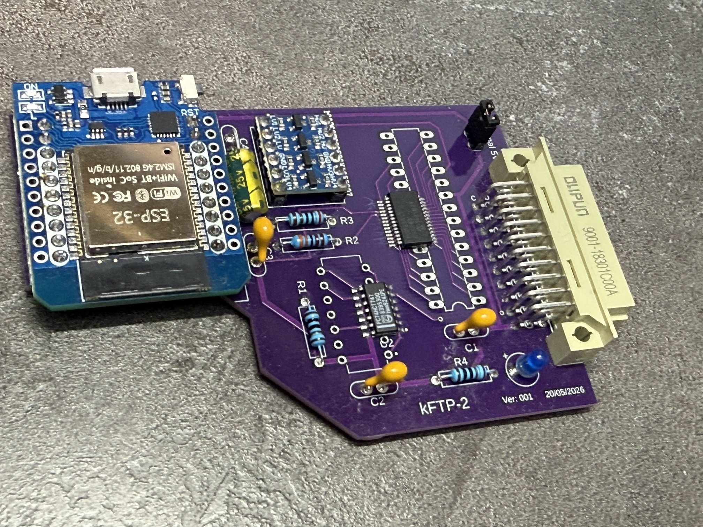
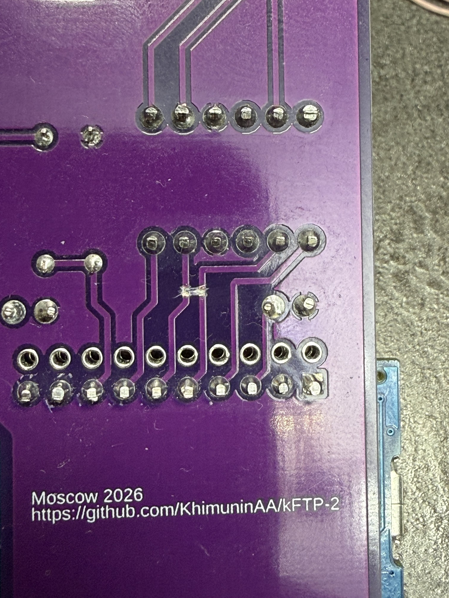
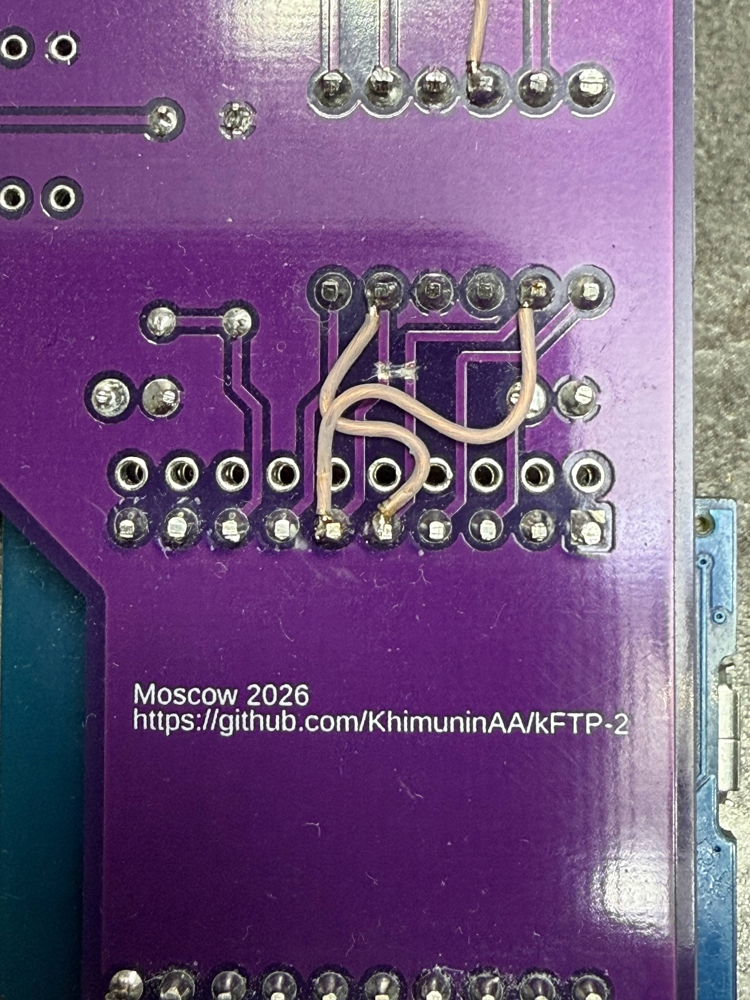
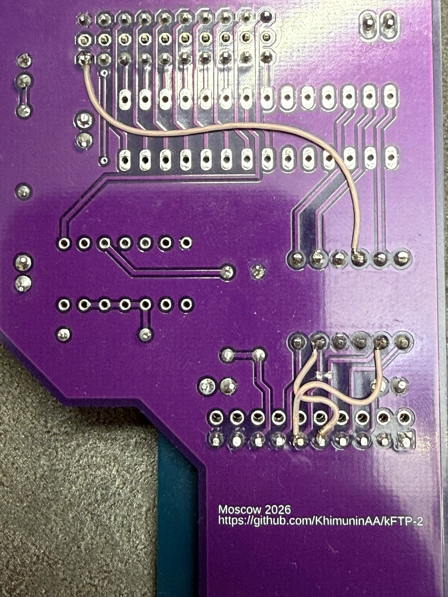
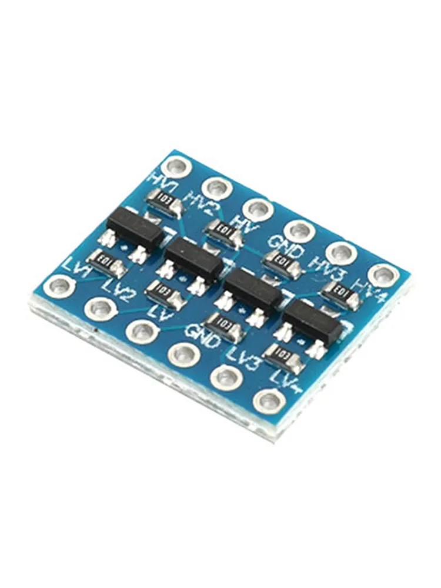

# Инструкция по сборке и прошивке платы Ver: 001 от 20.05.2026

## На плате допущены 2 ошибки:

### перепутаны сигналы MOSI и MISO

#### Режем дорожки

#### и соединаем правильно.

### нет напяжения 5В на плате преобразования логических уровней

#### кидаем провод на 5В

## Сборка

### Отладочная плата D1 mini ESP32 (можно покупать с тем разьемом USB какой вам удобно для прошивки)

#### Ссылки для примера:
 - https://www.ozon.ru/product/otladochnaya-plata-d1-mini-esp32-wi-fi-bluetooth-dlya-interneta-veshchey-polnaya-funktsionalnost-3422013338/?at=DqtDzZ2XgSRwmgpnTJg7rR3igrRQNKIvlYwpksQYEv8W
 - https://aliexpress.ru/item/1005006371447527.html?shpMethod=CAINIAO_ECONOMY&sku_id=12000036932891750&spm=a2g2w.productlist.search_results.1.5858660d4zj5UC

### Преобразователь логических уровней сигнала 3.3V - 5V, двунаправленный конвертер уровней 3,3В - 5В на 4 канала

#### Ссылки для примера:
- https://www.ozon.ru/product/preobrazovatel-logicheskih-urovney-signala-3-3v-5v-dvunapravlennyy-konverter-urovney-3-3v-5v-na-4-3865053333/?at=w0tgmnMoYTPpLW3RiY6D683tmD6z7s0LvJ82upOA3GR
- https://aliexpress.ru/item/1005006255186878.html?shpMethod=CAINIAO_SUPER_ECONOMY&sku_id=12000056439252576&spm=a2g2w.productlist.search_results.1.1abc35f84LphR1

### Для блокировочных конденсаторов отверстия  сделаны слишком близко (исправлю в следующей версии платы) 

### При запайке 30-ти пинового разъема можно не запаивать B ряд (он не используется)

### При запайке ESP модуля можно запаять только внутренние ряды контактов. (Внешние не используются)

### Ориентация ESP модуля - антенной в сторону фигурного выреза.

### На плате не указано расположение выводов для преобразователя уровней (исправлю в следующей версии платы), плату ориентировать выводами «L» в сторону ESP модуля.

## Сборка прошивки и загрузка в ESP32

Для прошивки ESP32 , самым простым вариантом является сборка и прошивка через Arduino IDE.
Установить можно через официальный сайт https://www.arduino.cc/
Если нет доступа к сайту или нужно поставить определенную версию, то можно скачать с github:  
https://github.com/arduino/arduino-ide/releases

Для сборки необходимо установить менеджер плат ESP32.
Простой способ - добавить строку «https://espressif.github.io/arduino-esp32/package_esp32_index.json» в настройку «Дополнительные ссылки для менеджера плат».
Если не смогли поставить в автоматическом режиме - то можно в ручную скачать с github: 
https://github.com/espressif/arduino-esp32

Так же для сборки нужны две библиотеки:
Adafruit BusIO и Adafruit MCP23017
Установить их можно через «Управление библиотеками»
Или самостоятельно с github: 
- https://github.com/adafruit/Adafruit_BusIO
- https://github.com/adafruit/Adafruit-MCP23017-Arduino-Library

## Если есть умение пользоваться утилитой esptool - есть бинарники (в релизах начиная с версии 006).

Пример запуска из терминала
esptool.py --chip esp32 --port /dev/cu.YOUR_USB_PORT --baud 921600 write_flash -z 0x10000 /path/to/your/firmware.bin

По такой схеме нужно будет запустить 4 раза с параметрами:
- 0x1000 kFTP2-ESP32D1-MCP23S17.ino.bootloader.bin
- 0x8000 kFTP2-ESP32D1-MCP23S17.ino.partitions.bin
- 0xe000 boot_app0.bin
- 0x10000 kFTP2-ESP32D1-MCP23S17.ino.bin