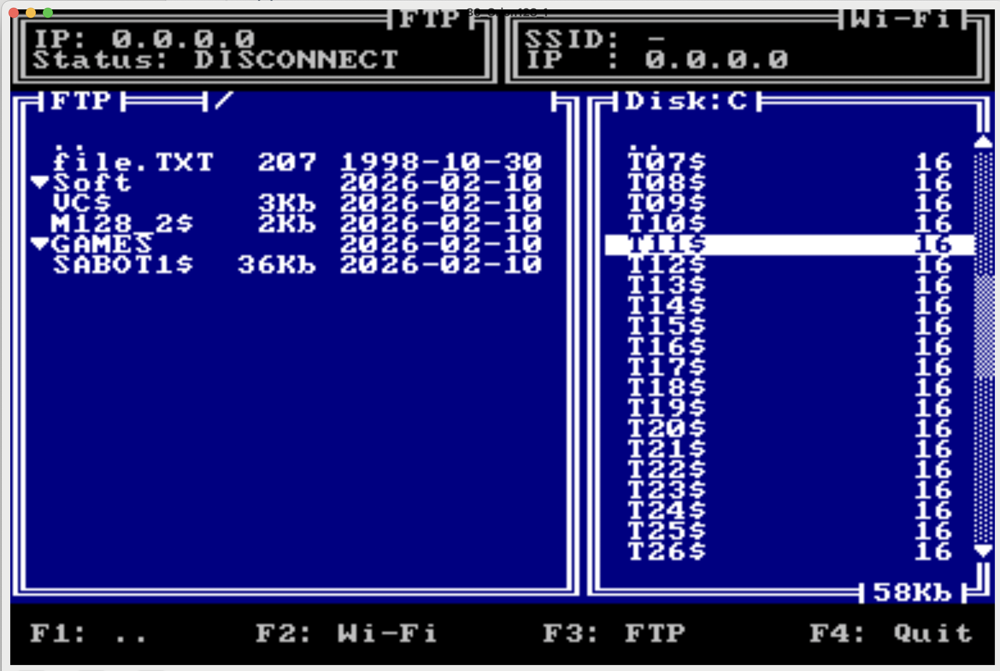

# kFTP-2

Новый FTP клиент, для компьютера Орион-128 (OrDOS 4+).

> [!NOTE]
> Большая благодарность Алексею Морозову за компилятор с8080 (https://github.com/alemorf/c8080). Без него проект бы не состоялся!

### Возможности программы:
- Подключение к Wi-Fi
- Подключение к FTP (для анонимного входа поля пользователь и пароль - должны быть пустыми)
- Работа с квазидиском: удаление файла, смена диска, закачка файла на FTP, форматирование диска, запуск приложения, добавлена поддержка до 255 файлов на квазидиске с отображением прогесса скролинга по диску, добавлен флаг сборки что бы выбрать какой стиль перемещения по файлам сделать (вверх/вниз или закольцованное перемещение)
- Работа с FTP: удаление файла, создание новой директории, перемещение по директориям, скачать файл с FTP, обновить список директории, переход в домашнюю директорию
- Настройки сохраняются в сетевой карте.

### У программы есть ряд ограничений:
- Работает под ORDOS
- Сервер FTP должен поддерживать стандарт RFC 3659, 2007
- Нельзя вводить русские буквы
- Вывод первых 20 файлов/директорий из текущей директории

### Сетевая карта:
- Для работы приложениянеобходима сетевая карта

### [Сборка ver: 001](AssemblyAndConfigurationV001.md)

### Схема

### Общий вид приложения

### Настройка Wi-Fi

### Настройка соединения с FTP

### Выбор квазидиска

### Руководство

### Пример отображения скролинга по диску

### Демонстрация работы 

[Ссылка на видео](https://www.dropbox.com/scl/fi/fjpdz2rtct6tolb2chyxq/333.mov?rlkey=0ujwcqpj9wu7sffe596ehs7jt&e=4&st=60j5yg07&dl=0).
